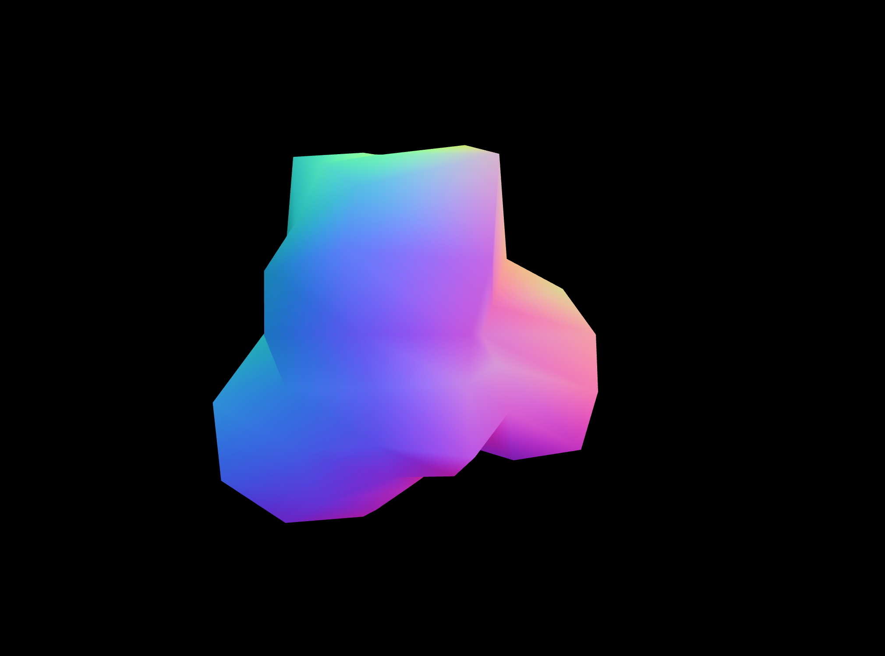

# Sculptural Infinity Chrome Extension

“Sculptural Infinity” is a virtual installation artwork designed by Cole Slater.  Because of the pandemic, many have been denied the opportunity to visit local museums.  “Sculptural Infinity” was created so that anyone can have an a work of art on their browser that is always changing and never looks same.  Every time you open a new tab, a slightly different sculpture appears.

### How To Install

1. Download this repo as a zip file and unzip it to a local folder
2. Open the `chrome://extensions` page
3. Enable developer mode (if it’s not already)
4. Click on “Load unpacked extension”
5. Select the extension folder

### Other Chrome extension concepts I am interested in creating
* Imaginary Friend: The imaginary friend chrome extension seems like fun and games, but becomes an online performance art piece demonstrating the dangers of emerging AI.
* VOTE: This chrome extension would equip users with all the resources needed to vote as well as tools to help others register and submit their ballots.
* Office Desk: This chrome extension would have the tools needed for anyone’s workspace: clock, timer, notepad, etc.
* Journaling: This chrome extension pack would prompt the user with a randomly generated writing prompt to help stay in touch with the users emotions.
